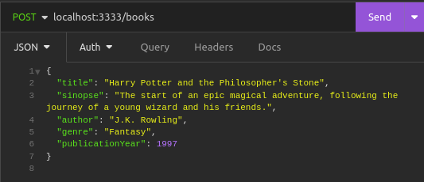
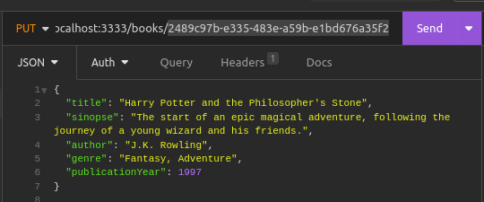

# :book: Booknexus

This project is a simple API to manage books, you can register and search for books easily.

## :wrench: Installation

To install and configure the project on your machine, follow these steps:

1. Clone that repository in you machine.
```bash
git clone https://github.com/gustaoliveira1/booknexus-api.git
```
2. Access the project directory and install the dependencies.
```bash
cd booknexus
```
```bash
npm install
```

3. Create a `.env` file in project root and paste the following code inside there.
```
DATABASE_URL="file:./dev.db"
```

4. Run the database migrate.
```bash
npx prisma migrate dev
```

5. Well! Now you can start the project.
```bash
npm run dev
```

## :electric_plug: Endpoints

These are the available endpoints:

**GET /books**
Returns a list of all cataloged books.

Example of response:
```json
[
	{
		"id": "2489c97b-e335-483e-a59b-e1bd676a35f2",
		"title": "Harry Potter and the Philosopher's Stone",
		"sinopse": "The start of an epic magical adventure, following the journey of a young wizard and his friends.",
		"author": "J.K. Rowling",
		"genre": "Fantasy",
		"publicationYear": 1997
	},
	{
		"id": "7e15878f-32f1-41bb-a64a-5141d2518504",
		"title": "1984",
		"sinopse": "A dystopian novel that explores themes of totalitarianism, surveillance, and the power of language.",
		"author": "George Orwell",
		"genre": "Science Fiction",
		"publicationYear": 1949
	},
	{
		"id": "7e222cee-a67d-4485-a143-96b7ca9bf12e",
		"title": "To Kill a Mockingbird",
		"sinopse": "A gripping portrayal of racial injustice and coming-of-age in the American South.",
		"author": "Harper Lee",
		"genre": "Fiction",
		"publicationYear": 1960
	},
	{
		"id": "8f3e2c0b-9f56-4af3-80ec-6dae19ced764",
		"title": "The Great Gatsby",
		"sinopse": "A tragic story set in the Jazz Age, exploring themes of wealth, love, and the American Dream.",
		"author": "F. Scott Fitzgerald",
		"genre": "Fiction",
		"publicationYear": 1925
	},
	{
		"id": "b3cf6702-e1ad-4dd9-b626-2cc8e969c602",
		"title": "Pride and Prejudice",
		"sinopse": "A classic tale of love, reputation, and societal expectations in 19th-century England.",
		"author": "Jane Austen",
		"genre": "Fiction",
		"publicationYear": 1813
	}
]
```

**GET /books/{id}**
Returns a specific book.

Example of reponse:
```json
{
	"id": "2489c97b-e335-483e-a59b-e1bd676a35f2",
	"title": "Harry Potter and the Philosopher's Stone",
	"sinopse": "The start of an epic magical adventure, following the journey of a young wizard and his friends.",
	"author": "J.K. Rowling",
	"genre": "Fantasy",
	"publicationYear": 1997
}
```

**GET /books?title**
Return books that match the query

Example of request:


Example of reponse:
```json
[
	{
		"id": "2489c97b-e335-483e-a59b-e1bd676a35f2",
		"title": "Harry Potter and the Philosopher's Stone",
		"sinopse": "The start of an epic magical adventure, following the journey of a young wizard and his friends.",
		"author": "J.K. Rowling",
		"genre": "Fantasy",
		"publicationYear": 1997
	}
]
```

**POST /books**
Catalog the book in database.

Example of request:


Example of response:
```json
{
	"id": "2489c97b-e335-483e-a59b-e1bd676a35f2",
	"title": "Harry Potter and the Philosopher's Stone",
	"sinopse": "The start of an epic magical adventure, following the journey of a young wizard and his friends.",
	"author": "J.K. Rowling",
	"genre": "Fantasy",
	"publicationYear": 1997
}
```

**PUT /books/{id}**
Updates a specific book.

Example of request:


Example of response:
```json
{
	"id": "2489c97b-e335-483e-a59b-e1bd676a35f2",
	"title": "Harry Potter and the Philosopher's Stone",
	"sinopse": "The start of an epic magical adventure, following the journey of a young wizard and his friends.",
	"author": "J.K. Rowling",
	"genre": "Fantasy, Adventure",
	"publicationYear": 1997
}
```

**DELETE /books/{id}**
Delete a specific book.

Example of request


This endpoint return 204 status. 

